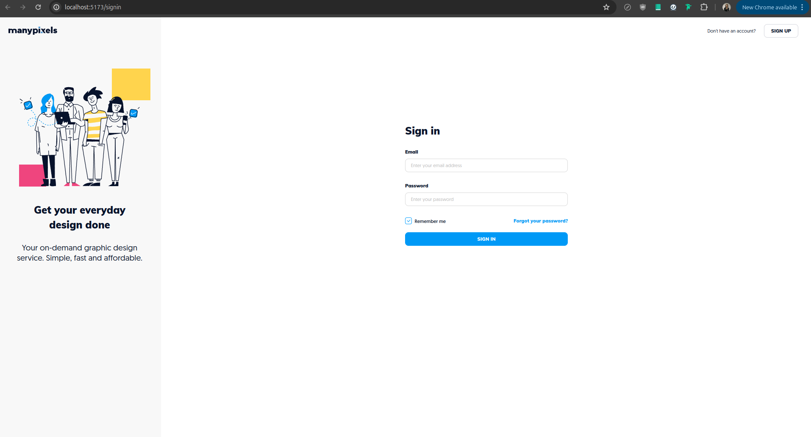

# ManyPixels App V2



## Table of Contents

- [Prerequisites](#prerequisites)
- [Installation](#installation)
- [Running the App](#running-the-app)
- [More documentation](#more-documentation)
- [License](#license)

## Prerequisites

In order to start the project locally, there are a few prerequisites:

#### Volta

This tool is used to make sure you are using the right node version while developping.  
=> [https://docs.volta.sh/guide/getting-started](https://docs.volta.sh/guide/getting-started)  

Version: *v1.1.1*
  
```bash
# Install Volta
curl https://get.volta.sh | bash
```

## Installation

1. Clone the repository:

```bash
git clone https://github.com/manypixels/app-v2
cd server-v2
```

2. Install dependencies:

```bash
npm install
```

3. Decrypt the `.env.encrypted` file in the root directory with the following command:

```bash
npm run env:decrypt
```

Ask the password to the previous contributors.

## Running the App

1. Start the server V2
Look at the instruction on [https://github.com/manypixels/server-v2/blob/main/README.md](https://github.com/manypixels/server-v2/blob/main/README.md)

2. Start the app in development mode with hot reloading:

```bash
npm run dev
```

The server will be accessible at `http://localhost:5173` (or the port specified in your `.env` file).

### Production Mode

Build and run the server for production:

```bash
npm run build
npm start
```

## More Documentation

- [Common Task](./documentation/help.md)

## License

This project is proprietary software owned by ManyPixels.